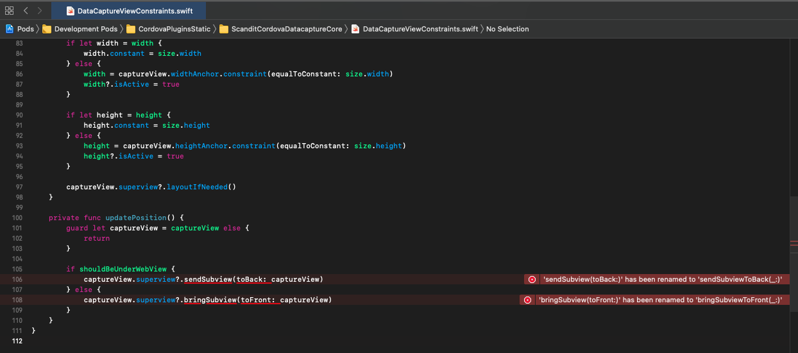
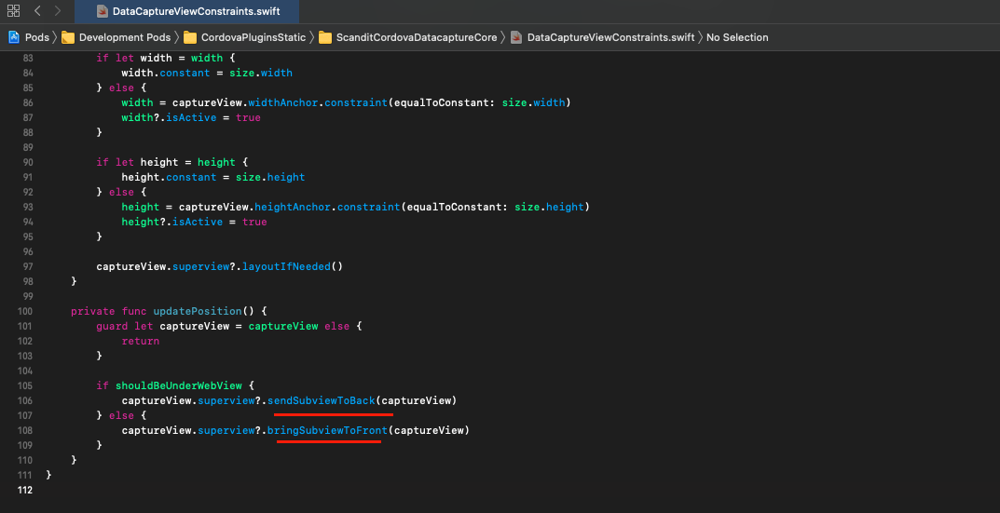

NOTE: As stated in the email, this is trying to get the Cordova SDK for Scandit to work in a Capacitor project.

# Requirements
This project was built and tested with the following software versions:
```
Scandit Cordova SDK Version: 6.8.0-beta.1
```

```
> node -v
v12.22.1
```

```
> npm -v
6.14.12
```

```
> ionic info

Ionic:

   Ionic CLI                     : 6.14.1 (/Users/admin/.npm-global/lib/node_modules/@ionic/cli)
   Ionic Framework               : @ionic/angular 5.6.6
   @angular-devkit/build-angular : 0.1102.13
   @angular-devkit/schematics    : 11.2.13
   @angular/cli                  : 11.2.13
   @ionic/angular-toolkit        : 3.1.1

Capacitor:

   Capacitor CLI   : 2.4.7
   @capacitor/core : 2.4.7

Utility:

   cordova-res                          : 0.15.3
   native-run (update available: 1.3.0) : 1.0.0

System:

   NodeJS : v12.22.1 (/usr/local/bin/node)
   npm    : 6.14.12
   OS     : macOS Big Sur
```

The plugins were installed using the following commands (not needed to run again).
```
npm install scandit-cordova-datacapture-core
npm install scandit-cordova-datacapture-barcode
npx cap sync
```

---

## Preparation

Clone/download this repository into an empty folder, then run in the root:
```
npm install
```

To test the app, add Scandit License keys inside `src/app/services.scanner.service.ts` at the top.

---

## IOS (WORKING)
To get iOS side to function was rather straight-forward. I am using `XCode 12.5`


Two issues were preventing builds. These were due to Apple API changes.



XCode suggested working fixes, so they were simple.



Thereafter, iOS builds operate correctly.

## Android (ISSUES)

This is where the real snag comes. I am using `Android Studio 4.1.3`

Builds fail right out the gate. Android studio seems to have some trouble configuring the Kotlin intergration.

```
Caused by: groovy.lang.MissingPropertyException: Could not get unknown property 'kotlin_version' for object of type org.gradle.api.internal.artifacts.dsl.dependencies.DefaultDependencyHandler.
```

When adding the variable to `build.gradle` as follows:
```gradle

buildscript {
    ext.kotlin_version= '1.5.0'
    repositories {
        google()
        jcenter()
    }
    ...
}
...
```
The error changes to:
```
Caused by: org.gradle.internal.metaobject.AbstractDynamicObject$CustomMessageMissingMethodException: Could not find method allOpen() for arguments [build_dun4hu8crw8nt50ryg5w3fy4u$_run_closure4@2483a20d] on project ':app' of type org.gradle.api.Project.

```
